

  <b><h1>FIND PETS</h1></b>
  

##

  <b><h1>💡 Sobre</h1></b>

Repositório com um programa desenvolvido para a disciplina de Projeto Integrador I, II, III, IV da fatec, onde ao longo do semestres foi implementado um site web responsivo com (CRUD) Create, Read, Update, Delete. (MVC) Model, View, Controller. Login, cadastro de usuário e animal, recuperar senha, geolocalização, impressão de pdf, Envio de e-mail para recuperação de senha, Anúncio conectado com a API do WhatsApp, Acessível na Língua brasileira de sinais (libras), Validações de senha, CPF, CEP e Data de nascimento, Upload / capturar imagem com rastreio de geolocalização, Filtros de pesquisa em SQL para o banco de dados MySQL.

##

  <b><h1>📊 Status do projeto</h1></b>

  <b>🏆 Finalizado 🏆</b>

##

  <b><h1>🎯 Tarefas</h1></b>

Clique para visualizar as tarefas feitas

|      Estado      |     Plataforma   |                 Tarefa                |
|      :---:       |       :---:      |                  :---:                |
|:heavy_check_mark:|:computer:        |Elabore um projeto web com crud que seja responsivo para mobile e que esteja hospedado com o tema de doações e adoções, denuncia e resgate, alerta de animal perdido, abandonado, encontrado|

##

  <b><h1>Resultados</h1></b>

  
# Resultado na hospedagem infinityfreeapp
Clique em [`Testar site find pets`](https://find-pets.infinityfreeapp.com/) para testar o resultado do projeto find pets.
  

---
---

  <b><h1>Find Pets - MIT APP Inventor</h1></b>
  
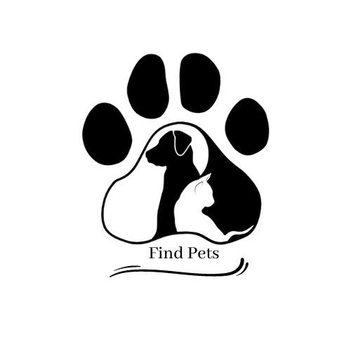

##

  <b><h1>Resultados</h1></b>

  
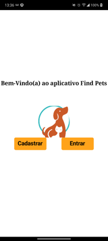
# Tela de carregamento
  
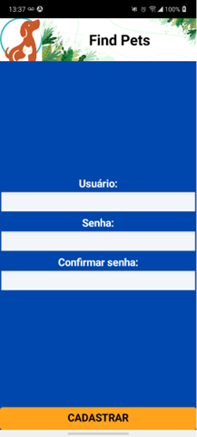
# Tela de cadastro

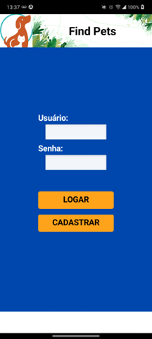
# Tela de login

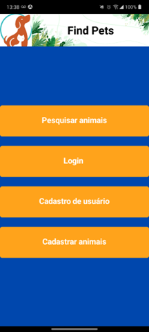
# Tela de menu

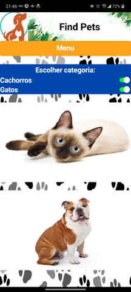
# Tela de pesquisa de animais

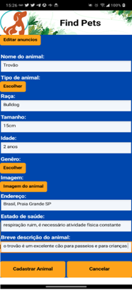
# Tela de cadastro de animais 1

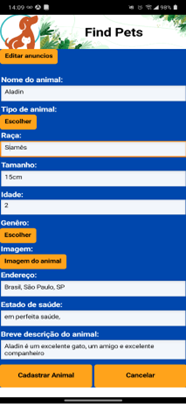
# Tela de cadastro de animais 2

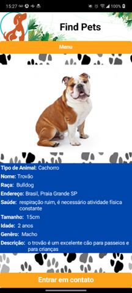
# Tela de anúncio 1

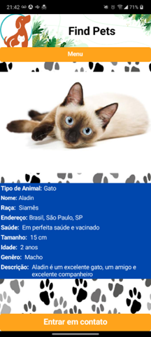
# Tela de anúncio 2

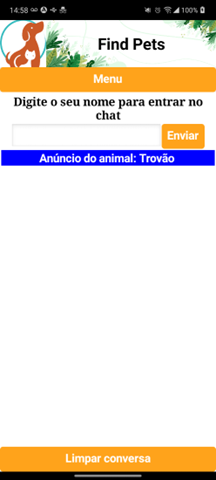
# Tela de chat 1

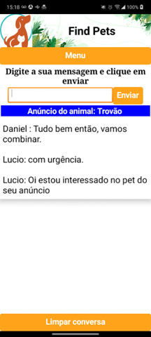
# Tela de chat 2

---
---

  <b><h1>💻 Download</h1></b>

Para fazer uso desse repositório e dos códigos, você pode cloná-lo em seu GitHub com a opção de fork ou clique em [`baixar`](https://github.com/RamonCintas/FindPets/archive/refs/heads/main.zip) esse repositório.

##

  <b><h1>⚔️ Tecnologias</h1></b>

As seguintes ferramentas foram utilizadas para desenvolver esse repositório:

|Ferramentas|
|:-:|
|[Sistema Windows](https://www.microsoft.com/pt-br/windows)|
|[HTML](https://www.w3schools.com/html/)|
|[CSS](https://www.w3schools.com/Css/)|
|[JavaScript](https://www.w3schools.com/js/DEFAULT.asp)|
|[PHP](https://www.php.net/)|
|[MySQL](https://www.microsoft.com/pt-br/sql-server/sql-server-downloads)|
|[Visual Studio Code](https://code.visualstudio.com/)|
|[Hospedagem Infinityfreeapp](https://www.infinityfree.com/)|
|[MIT App Inventor](https://appinventor.mit.edu/)|

##

  <b><h1> 👨‍💻 Autor</h1></b>

<a href="https://github.com/RamonCintas">
 
  
 <b>Ramon Cintas</b>
</a>

Desenvolvido por Ramon Cintas entre em contato!

  
 
 

##

  <b><h1>⚖️ Licença</h1></b>

Copyright © [Ramon Cintas](https://github.com/RamonCintas). 
Este projeto é licenciado por [MIT](./LICENSE).

---
## Observação:
## Mudar os links de referência
## Configurar a conexão do o banco de dados no dbconfig e tabelas de anuncios e usuarios na sua base de dados
## Mudar o email de ramoncg.oficial2018@gmail.com para o email do administrador
## Mudar o email de recuperar senha de findpets.global@gmail.com para o email do administrador
## Criar uma conta no openrouteservice e inserir o token de acesso na var apiKey no arquivo de animal,php para o mapa acessar a API e fazer a rota do local atual para o local do cadastro do anuncio do animal 
---
